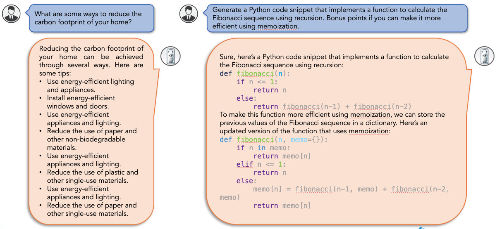
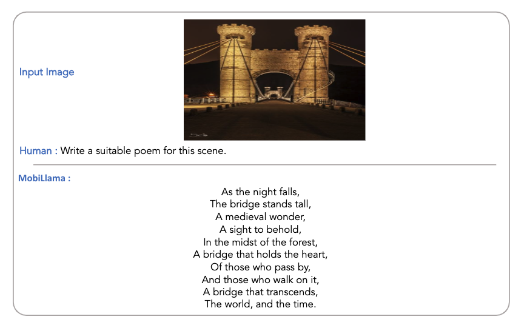
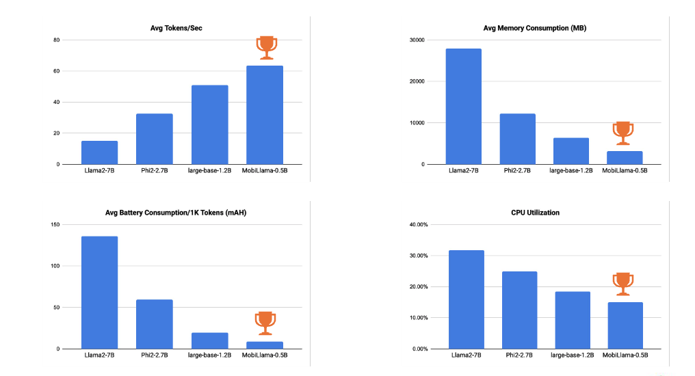

<br>
<p align="center">
<iframe width="560" height="315" src="https://www.youtube.com/embed/9NSlqpWqYLg" title="YouTube video player" frameborder="0" allow="accelerometer; autoplay; clipboard-write; encrypted-media; gyroscope; picture-in-picture; web-share" allowfullscreen></iframe>
</p>

<div style="position: relative; padding-bottom: 56.25%; height: 0; overflow: hidden;">
  <iframe 
    style="position: absolute; top: 0; left: 0; width: 100%; height: 100%;" 
    src="https://www.youtube.com/embed/9NSlqpWqYLg" 
    title="YouTube video player" 
    frameborder="0" 
    allow="accelerometer; autoplay; clipboard-write; encrypted-media; gyroscope; picture-in-picture; web-share" 
    allowfullscreen>
  </iframe>
</div>


<br>

## Abstract
<p align="justify">
<i><b>Bigger the better</b></i> has been the predominant trend in recent Large Language Models (LLMs) development. However, LLMs do not suit well for scenarios that require on-device processing, energy efficiency, low memory footprint, and response efficiency. These requisites are crucial for privacy, security, and sustainable deployment. This paper explores the <i><b>less is more</b></i> paradigm by addressing the challenge of designing accurate yet efficient Small Language Models (SLMs) for resource constrained devices. Our primary contribution is the introduction of an accurate and fully transparent open-source 0.5 billion (0.5B) parameter SLM, named <i><b>MobiLlama</b></i>, catering to the specific needs of resource-constrained computing with an emphasis on enhanced performance with reduced resource demands. MobiLlama is a SLM design that initiates from a larger model and applies a careful parameter sharing scheme to reduce both the pre-training and the deployment cost. </p>


## MobiLlama Architecture

<p align="justify"> The proposed approach, MobiLlama, constructs a SLM of desired sizes (e.g., 0.5B model) by first initiating from a larger model size design, largebase. Then, we employ a careful parameter sharing scheme to reduce the model size to a pre-defined model configuration, thereby significantly reducing the training cost. Generally, both SLMs and LLMs typically utilize a dedicated multilayer perceptron (MLP) block comprising multiple feed forward network (FFN) layers within each transformer block. In such a configuration (e.g., large-base), the FFN layers account for a substantial 65% of the total trainable parameters, with attention mechanisms and heads contributing 30% and 5%, respectively. As a consequence, a significant number of parameters are concentrated within the FFN layers, thereby posing challenges during pre-training with respect to computational cost and the model’s ability to achieve faster convergence. To address these issues, we propose to use a sharing scheme where the FFN parameters are shared across all transformer layers within the SLM. This enables us to significantly reduce the overall trainable parameters by 60% in our MobiLlama, compared to the large-base. Such a significant parameter reduction also enables us to increase the model capacity in terms of number of layers and hidden dimension size without any substantial increase in the training cost. </p>


## MobiLlama in comparison with existing <1B Models

<p align="justify">State-of-the-art comparisons with existing < 1B params models on nine benchmarks. In case of around 0.5B model series, our MobiLlama achieves a substantial gain of 2.4% in terms of average performance on nine benchmarks. Further, our MobiLlama 0.8B model achieves an average score of 46.67. </p>

<p align="center">
   
</p>


## Qualitative Examples of MobiLlama

<p align="justify"> Example responses from our MobiLlama across a variety of tasks, including creative storytelling, coding exercises, economic analysis, and cooking instructions. The responses highlight the models’ ability to engage with both abstract concepts and practical, step-by-step processes, demonstrating its broad applicability. </p>


## Qualitative Examples of MobiLlama-VLM

Example responses of MobiLlama-V in responding to visual stimuli across a range of scenarios.


## Hardware Platform Comparison

<p align="justify"> Comparison in terms of efficiency and resource consumption on different low-end hardware devices. We show the comparison on: a PC with RTX-2080Ti GPU, a laptop with i7 CPU and a smartphone with Snapdragon-685 processor. In addition to our large-base model, we also present the comparison with Llama2 7B and Phi2 2.7B. In case of CPU and smartphone, we use 4-bit GGUF format of the corresponding models, whereas the original models are deployed and tested on PC with RTX-2080Ti GPU. The different metrics measure the model’s operational efficiency, model’s footprint in the device’s RAM and the energy efficiency of processing 1,000 tokens. Our MobiLlama performs favorably in terms of efficiency on these low-end hardware devices. We note that both Phi2 and Llama2 are not fully transparent in that the complete data pipeline for pre-training is not publicly available. </p>


## BibTeX
If you like our work, please consider citing us.
```
@misc{thawakar2024mobillama,
      title={MobiLlama: Towards Accurate and Lightweight Fully Transparent GPT}, 
      author={Omkar Thawakar and Ashmal Vayani and Salman Khan and Hisham Cholakkal and Rao Muhammad Anwer and Michael Felsberg and Timothy Baldwin and Eric P. Xing and Fahad Shahbaz Khan},
      year={2024},
      eprint={2402.16840},
      archivePrefix={arXiv},
      primaryClass={cs.CL}
} 
```
